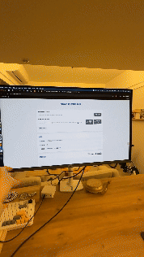
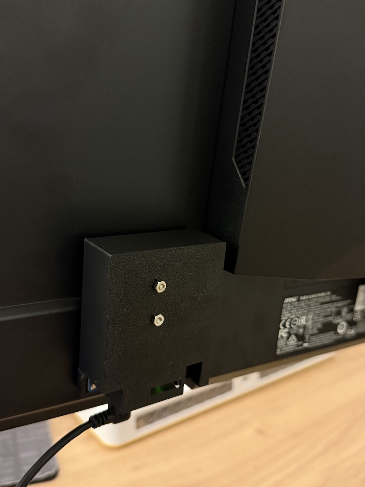

# Screen Auto-Rotation Controller

This is a Flask-based web application for automatic screen rotation control. It communicates with an Arduino device through a serial port, which has an MPU6050 sensor installed to receive angle data, and uses the `displayplacer` command to rotate the specified display.

## Function Demo



## Hardware Setup



## Features

- Web interface, easy to use
- Automatically detects available serial ports and displays
- Real-time display of connection status and received data
- Debug mode for easy troubleshooting
- Responsive design, adaptable to different devices

## System Requirements

- Python 3.6+
- Flask and related dependencies
- `displayplacer` command-line tool (for controlling displays)
- Supported operating system: macOS (requires `displayplacer`)

## Installation

1. Clone or download this project to your local machine

2. Install the required Python dependencies:

```bash
pip install -r requirements.txt
```

3. Install `displayplacer` (if not already installed):

```bash
brew install displayplacer
```

## Usage

### Starting the Application

1. Navigate to the project directory in the terminal

2. Run the Flask application:

```bash
python web_screen_rotator.py
```

3. Open a browser and visit:

```
http://localhost:8098
```

### Using the Interface

1. Select the Arduino serial port from the dropdown menu
2. Select the display to control from the dropdown menu
3. Click the "Start Monitoring" button to begin monitoring the serial port
4. When the Arduino sends angle data (0, 90, 180, 270), the application will automatically rotate the selected display
5. Click the "Stop Monitoring" button to stop monitoring

## Debugging Guide

### Enabling Debug Mode

1. In the web interface, find the "Debug Log" panel
2. Toggle the "Debug Mode" switch to enable debugging
3. The debug log will display detailed operation and error information

### Troubleshooting Common Issues

#### Serial Port Not Found

- Ensure the Arduino is properly connected to the computer
- Click the "Refresh" button to update the serial port list
- Check if the Arduino driver is correctly installed

#### Display Not Found

- Ensure `displayplacer` is correctly installed
- Click the "Refresh" button to update the display list
- Run `displayplacer list` in the terminal to check if displays can be listed

#### Unable to Rotate Display

- Check if `displayplacer` has sufficient permissions (macOS may require granting accessibility permissions)
- View error messages in the debug log
- Try running the `displayplacer` command manually in the terminal

#### Connection Issues

- Check if the Arduino is correctly sending data
- Confirm the serial port baud rate is set to 9600
- Check if the serial port connection is stable

### Advanced Debugging

#### Viewing Flask Logs

The Flask application outputs log information to the terminal during runtime, including requests and errors. This information is very useful for troubleshooting.

#### Checking WebSocket Connection

If real-time updates are not working, it might be a WebSocket connection issue. Open the browser's developer tools and check the console for related errors.

#### Testing Serial Communication

You can use serial monitoring tools (such as `screen` or `minicom`) to test communication with the Arduino:

```bash
screen /dev/tty.usbmodem* 9600
```

## Project Structure

```
auto_screen_detection/
├── web_screen_rotator.py  # Main Flask application file
├── requirements.txt       # Python dependencies
├── templates/             # HTML templates
│   └── index.html        # Main page
└── static/               # Static files
    ├── css/              # CSS styles
    │   └── style.css     # Main stylesheet
    └── js/               # JavaScript files
        └── app.js        # Frontend logic
```

## License

This project is licensed under the MIT License. See the LICENSE file for details.

## Contributions

Welcome to submit issue reports and improvement suggestions! 